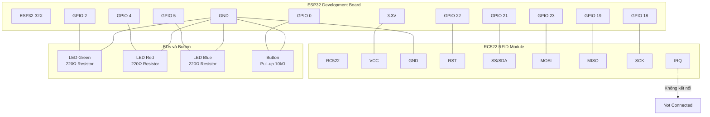

# Sơ đồ nối mạch chi tiết ESP32 + RC522

## Sơ đồ kết nối tổng quan



## Sơ đồ mạch chi tiết

```mermaid
circuit
    subgraph "ESP32-32X Development Board"
        ESP32[ESP32-32X]
        VCC_3V3[3.3V]
        GND_ESP[GND]
        GPIO22[GPIO 22]
        GPIO21[GPIO 21]
        GPIO23[GPIO 23]
        GPIO19[GPIO 19]
        GPIO18[GPIO 18]
        GPIO2[GPIO 2]
        GPIO4[GPIO 4]
        GPIO5[GPIO 5]
        GPIO0[GPIO 0]
    end
    
    subgraph "RC522 RFID Module"
        RC522[RC522]
        VCC_RC[VCC]
        GND_RC[GND]
        RST_RC[RST]
        SS_RC[SS/SDA]
        MOSI_RC[MOSI]
        MISO_RC[MISO]
        SCK_RC[SCK]
        IRQ_RC[IRQ]
    end
    
    subgraph "LEDs với Resistor"
        R1[220Ω]
        R2[220Ω]
        R3[220Ω]
        LED1[LED Green]
        LED2[LED Red]
        LED3[LED Blue]
    end
    
    subgraph "Button với Pull-up"
        R4[10kΩ]
        BTN[Button]
    end
    
    %% Kết nối nguồn
    VCC_3V3 --- VCC_RC
    GND_ESP --- GND_RC
    GND_ESP --- R1
    GND_ESP --- R2
    GND_ESP --- R3
    GND_ESP --- BTN
    
    %% Kết nối SPI
    GPIO22 --- RST_RC
    GPIO21 --- SS_RC
    GPIO23 --- MOSI_RC
    GPIO19 --- MISO_RC
    GPIO18 --- SCK_RC
    
    %% Kết nối LEDs
    GPIO2 --- R1
    R1 --- LED1
    GPIO4 --- R2
    R2 --- LED2
    GPIO5 --- R3
    R3 --- LED3
    
    %% Kết nối Button
    VCC_3V3 --- R4
    R4 --- GPIO0
    GPIO0 --- BTN
    
    %% IRQ không kết nối
    IRQ_RC -.->|"Không sử dụng"| NC[Not Connected]
```

## Bảng kết nối chi tiết

| RC522 Pin | ESP32 Pin | Chức năng | Ghi chú |
|-----------|-----------|-----------|---------|
| VCC | 3.3V | Nguồn điện | 3.3V, không dùng 5V |
| GND | GND | Mass | Chung mass |
| RST | GPIO 22 | Reset | Reset module |
| SS/SDA | GPIO 21 | Slave Select | Chọn thiết bị SPI |
| MOSI | GPIO 23 | Master Out Slave In | Dữ liệu từ ESP32 đến RC522 |
| MISO | GPIO 19 | Master In Slave Out | Dữ liệu từ RC522 đến ESP32 |
| SCK | GPIO 18 | Serial Clock | Xung đồng hồ SPI |
| IRQ | - | Interrupt | Không kết nối |

## LEDs và Button

| Component | ESP32 Pin | Resistor | Chức năng |
|-----------|-----------|----------|-----------|
| LED Green | GPIO 2 | 220Ω | Trạng thái thành công |
| LED Red | GPIO 4 | 220Ω | Trạng thái lỗi |
| LED Blue | GPIO 5 | 220Ω | Trạng thái đọc RFID |
| Button | GPIO 0 | 10kΩ Pull-up | Reset/Test |

## Sơ đồ breadboard

```
                    ESP32-32X Development Board
    ┌─────────────────────────────────────────────────────────────┐
    │  [ESP32]                                                   │
    │                                                             │
    │  3.3V ──────────────────────────────────────────────────────┤
    │  GND  ──────────────────────────────────────────────────────┤
    │  GPIO22 ────────────────────────────────────────────────────┤
    │  GPIO21 ────────────────────────────────────────────────────┤
    │  GPIO23 ────────────────────────────────────────────────────┤
    │  GPIO19 ────────────────────────────────────────────────────┤
    │  GPIO18 ────────────────────────────────────────────────────┤
    │  GPIO2  ────────────────────────────────────────────────────┤
    │  GPIO4  ────────────────────────────────────────────────────┤
    │  GPIO5  ────────────────────────────────────────────────────┤
    │  GPIO0  ────────────────────────────────────────────────────┤
    └─────────────────────────────────────────────────────────────┘
                                    │
                                    │ Dây nối
                                    │
    ┌─────────────────────────────────────────────────────────────┐
    │                    Breadboard                               │
    │                                                             │
    │  RC522 Module:                                              │
    │  ┌─────────────┐                                            │
    │  │ VCC  GND    │                                            │
    │  │ RST  SS     │                                            │
    │  │ MOSI MISO   │                                            │
    │  │ SCK  IRQ    │                                            │
    │  └─────────────┘                                            │
    │                                                             │
    │  LEDs:                                                      │
    │  [LED-G] [LED-R] [LED-B]                                    │
    │     │       │       │                                       │
    │  [220Ω] [220Ω] [220Ω]                                       │
    │                                                             │
    │  Button:                                                    │
    │  [Button]                                                   │
    │     │                                                       │
    │  [10kΩ]                                                     │
    └─────────────────────────────────────────────────────────────┘
```

## Lưu ý quan trọng

### 1. Điện áp
- RC522 chỉ hoạt động ở 3.3V
- Không kết nối VCC của RC522 với 5V
- ESP32 cung cấp 3.3V ổn định

### 2. Resistor
- LED: 220Ω - 1kΩ (khuyến nghị 220Ω)
- Button: 10kΩ pull-up resistor
- Có thể dùng INPUT_PULLUP thay vì resistor ngoài

### 3. Kết nối SPI
- Đảm bảo kết nối SPI chính xác
- MOSI, MISO, SCK phải kết nối đúng
- SS (Slave Select) quan trọng cho giao tiếp

### 4. Antenna
- Đảm bảo antenna RC522 không bị che khuất
- Khoảng cách đọc: 2-5cm
- Tránh kim loại gần antenna

### 5. Nguồn điện
- ESP32 cần nguồn ổn định
- RC522 tiêu thụ ~150mA khi đọc
- Đảm bảo nguồn đủ công suất

## Code test kết nối

```cpp
#include <SPI.h>
#include <MFRC522.h>

#define RST_PIN 22
#define SS_PIN 21
#define LED_GREEN 2
#define LED_RED 4
#define LED_BLUE 5
#define BUTTON_PIN 0

MFRC522 mfrc522(SS_PIN, RST_PIN);

void setup() {
    Serial.begin(115200);
    SPI.begin();
    mfrc522.PCD_Init();
    
    pinMode(LED_GREEN, OUTPUT);
    pinMode(LED_RED, OUTPUT);
    pinMode(LED_BLUE, OUTPUT);
    pinMode(BUTTON_PIN, INPUT_PULLUP);
    
    Serial.println("RFID Reader Ready");
    digitalWrite(LED_BLUE, HIGH);
}

void loop() {
    // Test LEDs
    if (digitalRead(BUTTON_PIN) == LOW) {
        digitalWrite(LED_GREEN, HIGH);
        delay(100);
        digitalWrite(LED_GREEN, LOW);
    }
    
    // Test RFID
    if (mfrc522.PICC_IsNewCardPresent() && mfrc522.PICC_ReadCardSerial()) {
        digitalWrite(LED_BLUE, LOW);
        digitalWrite(LED_GREEN, HIGH);
        
        Serial.print("RFID UID: ");
        for (byte i = 0; i < mfrc522.uid.size; i++) {
            Serial.print(mfrc522.uid.uidByte[i] < 0x10 ? " 0" : " ");
            Serial.print(mfrc522.uid.uidByte[i], HEX);
        }
        Serial.println();
        
        delay(1000);
        digitalWrite(LED_GREEN, LOW);
        digitalWrite(LED_BLUE, HIGH);
        
        mfrc522.PICC_HaltA();
        mfrc522.PCD_StopCrypto1();
    }
}
```

## Troubleshooting

### RC522 không đọc được thẻ
1. Kiểm tra kết nối SPI
2. Xác nhận điện áp 3.3V
3. Kiểm tra antenna không bị che
4. Test với thẻ RFID khác

### LED không sáng
1. Kiểm tra cực tính LED
2. Xác nhận resistor hạn dòng
3. Test với multimeter

### Button không hoạt động
1. Kiểm tra pull-up resistor
2. Sử dụng INPUT_PULLUP
3. Test continuity

### ESP32 không boot
1. Kiểm tra nguồn điện
2. Xác nhận kết nối GND
3. Kiểm tra jumper boot mode
